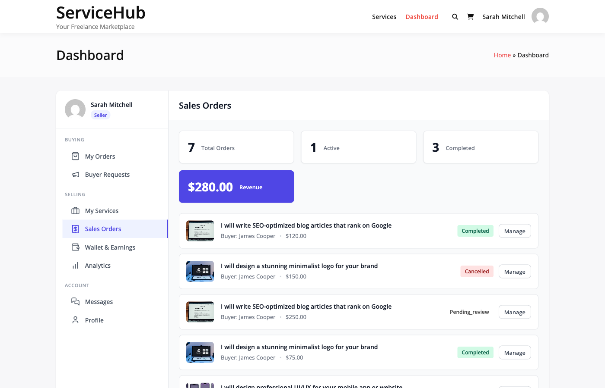

# Vendor Dashboard

Your vendor dashboard is the central hub for managing all your selling activities on the marketplace.

## Accessing Your Dashboard

Navigate to **My Account → Dashboard** or use the shortcode `[wpss_dashboard]` which automatically displays vendor features when you're logged in as a vendor.

## Dashboard Navigation

The vendor dashboard includes these main sections:

- **Orders**: View and manage active and completed orders
- **Services**: Create and edit your service listings
- **Messages**: Communicate with buyers about orders
- **Earnings**: Track income, withdrawals, and financial history
- **Reviews**: View feedback received from buyers
- **Notifications**: Stay updated on important activities

## Orders Section

Manage all your orders in one place.

### Viewing Orders

The Orders section displays:

- **Active Orders**: Current orders in progress
- **Pending Requirements**: Orders waiting for buyer information
- **Pending Approval**: Completed work awaiting buyer review
- **Revision Requests**: Orders requiring additional work
- **Completed Orders**: Successfully delivered services
- **Cancelled/Disputed**: Problem orders requiring attention

### Order Filters

Filter orders by:

- **Status**: pending, in progress, completed, cancelled, disputed
- **Date Range**: Last 7 days, 30 days, custom range
- **Service**: Filter by specific service
- **Buyer**: Filter by buyer name

### Managing Individual Orders

For each order, you can:

1. View detailed order information
2. Download buyer requirements
3. Upload deliverables
4. Mark order as complete
5. Request delivery time extension
6. Communicate with the buyer
7. View order timeline

## Services Section

Create and manage your service listings.

### Service Management

- **Add New Service**: Create a new service listing
- **Edit Existing Services**: Update pricing, descriptions, packages
- **Duplicate Services**: Copy services to create similar listings
- **Pause/Unpause Services**: Temporarily stop receiving new orders
- **Delete Services**: Remove listings (only if no active orders)

### Service Statistics

View performance metrics for each service:

- Total orders
- Completion rate
- Average rating
- Total revenue
- Active orders

Learn more about [creating and managing services](../services/creating-services.md).

## Messages Section

Communicate with buyers about order requirements and delivery.

### Message Features

- **Order Conversations**: Dedicated message thread for each order
- **File Attachments**: Share files and documents
- **Notifications**: Get alerted to new messages
- **Message History**: View complete conversation history

### Best Practices

- Respond to buyer messages within 24 hours
- Be professional and courteous
- Ask clarifying questions about requirements
- Keep all communication on the platform
- Document important agreements in messages

## Earnings Section

Track your income and financial performance.

### Earnings Overview

View your financial summary:

- **Total Earnings**: All-time gross income
- **Pending Earnings**: Orders in progress or awaiting completion
- **Available for Withdrawal**: Cleared earnings ready to withdraw
- **Withdrawn**: Already paid out earnings

### Understanding Commission

Each order shows:

- **Order Total**: What the buyer paid
- **Commission**: Platform fee deducted
- **Net Earnings**: What you receive

The commission rate is set by the site administrator. **[PRO]** Some marketplaces offer per-vendor commission rates.

### Withdrawal Requests

Request payouts when you reach the minimum withdrawal threshold:

1. Navigate to **Earnings → Withdraw**
2. Enter the withdrawal amount
3. Select payment method
4. Submit withdrawal request
5. Wait for admin processing

Learn more about [earnings and payouts](earnings-payouts.md).

## Reviews Section

View and manage feedback from buyers.

### Review Display

Each review shows:

- **Buyer Name**: Who left the review
- **Service**: Which service was reviewed
- **Overall Rating**: 1-5 stars
- **Sub-Ratings**: Communication, Quality, Delivery Time
- **Review Text**: Written feedback
- **Date**: When the review was submitted

### Response to Reviews

Some marketplaces allow vendor responses:

- Reply to buyer feedback
- Thank buyers for positive reviews
- Address concerns in negative reviews
- Keep responses professional

Learn more about the [review system](../buyer-guide/reviews-ratings.md).

## Notifications Section

Stay informed about important activities:

- **New Orders**: When a buyer purchases your service
- **Order Messages**: New communication from buyers
- **Delivery Approved**: Buyer accepted your work
- **Revision Requested**: Buyer needs changes
- **Review Received**: New feedback on your work
- **Withdrawal Processed**: Payout completed
- **Dispute Opened**: Issue with an order

### Notification Settings

Customize how you receive notifications:

- Email notifications
- In-dashboard alerts
- Notification frequency preferences

## Dashboard Statistics

The dashboard homepage displays key metrics:

| Metric | Description |
|--------|-------------|
| **Active Orders** | Orders currently in progress |
| **Completion Rate** | Percentage of successfully delivered orders |
| **Average Rating** | Overall star rating from all reviews |
| **Response Time** | Average time to reply to messages |
| **Total Revenue** | All-time earnings before commission |
| **This Month's Earnings** | Current month's income |

## Mobile Access

The vendor dashboard is responsive and works on:

- Desktop computers
- Tablets
- Mobile phones

Access your dashboard on the go to stay connected with buyers.

## Dashboard Customization **[PRO]**

Pro marketplaces may offer additional dashboard features:

- **Analytics**: Detailed performance metrics
- **Wallet Integration**: View wallet balance and transactions
- **Cloud Storage**: Direct file storage integration
- **Advanced Reporting**: Export data and custom reports

## Tips for Dashboard Efficiency

1. **Check Daily**: Review new orders and messages each day
2. **Set Notifications**: Enable email alerts for urgent items
3. **Update Regularly**: Keep service listings current
4. **Monitor Earnings**: Track your financial performance
5. **Respond Quickly**: Fast responses improve buyer satisfaction
6. **Use Filters**: Organize orders efficiently with filters

## Troubleshooting

### Dashboard Not Loading

- Clear browser cache and cookies
- Try a different browser
- Check internet connection
- Contact site support

### Missing Orders or Services

- Verify you're logged in as a vendor
- Check order status filters
- Ensure services haven't been deleted
- Contact support if data is missing

### Statistics Not Updating

- Dashboard statistics update hourly
- Refresh the page to see latest data
- Some metrics update at end of day
