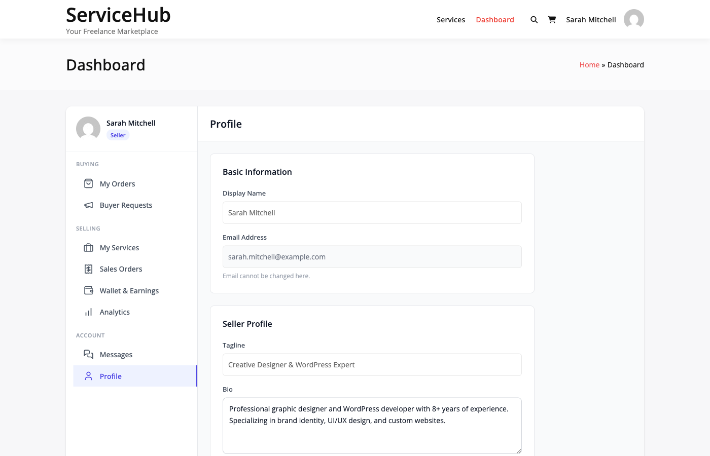

# Becoming a Vendor

Learn how to register as a vendor and start selling services on the marketplace.

## Registration Methods

The marketplace offers three registration modes depending on the administrator's configuration:

- **Open**: Anyone can register as a vendor directly
- **Requires Approval**: Admin must approve new vendor applications
- **Closed**: Only administrators can create vendor accounts

Check the vendor registration page to see which mode is active.

## How to Register

### Step 1: Access Registration

Navigate to the vendor registration page using the `[wpss_become_vendor]` or `[wpss_vendor_registration]` shortcode.

If you already have a buyer account, log in first and visit the "Become a Vendor" page to upgrade your account.

### Step 2: Complete Registration Form

Fill in the required information:

| Field | Description | Required |
|-------|-------------|----------|
| **Display Name** | Your public vendor name | Yes |
| **Professional Tagline** | One-line description (100 chars max) | Yes |
| **About You** | Your background and experience | Yes |
| **Skills** | Comma-separated skills | Yes |
| **Terms Agreement** | Accept marketplace terms | Yes |

### Step 3: Submit Application

After submitting:

**Open Registration Mode:**
- Account activated immediately
- You can create services right away
- Status: Active

**Approval Required Mode:**
- Account status: Pending Approval
- Administrator will review your application
- You'll receive email notification when approved/rejected
- Typical review: 1-3 business days

**Closed Registration Mode:**
- Registration form is hidden
- Contact administrator for account creation

## Vendor Role and Capabilities

Once approved, you receive the `wpss_vendor` role with these capabilities:

- `wpss_vendor` - Vendor status marker
- `wpss_manage_services` - Create and edit services
- `wpss_manage_orders` - View and manage orders
- `wpss_view_analytics` - Access earnings and stats
- `wpss_respond_to_requests` - Respond to buyer requests
- `read` - Standard WordPress access
- `upload_files` - Upload attachments
- `edit_posts` - Create content

## Verification Tiers

All new vendors start at the **Basic** tier. You can progress to:

- **Basic**: Default starting tier
- **Verified**: Identity/email verified
- **Pro**: Premium verification status

Learn more in [Seller Levels](seller-levels.md).

## After Registration

Once your vendor account is active:

1. **Access Dashboard**: Navigate to the unified dashboard
2. **Complete Profile**: Add details, photo, and portfolio
3. **Create First Service**: List your first service offering
4. **Configure Settings**: Set availability and preferences

## What You Can Do as a Vendor

Access to vendor features:

| Feature | Description |
|---------|-------------|
| **Vendor Dashboard** | Manage selling activities |
| **Create Services** | List services for buyers |
| **Receive Orders** | Accept and fulfill orders |
| **Portfolio** | Showcase previous work |
| **Earnings** | Track income and withdrawals **[PRO]** |
| **Buyer Requests** | Respond to service requests |
| **Messages** | Communicate with buyers |

## Vendor Settings Location

Administrators configure vendor registration at:

**WP Sell Services → Settings → Vendor**

Available settings:
- **Vendor Registration Mode**: open/approval/closed
- **Max Services Per Vendor**: Service creation limit (default: 20)
- **Require Verification**: Email verification toggle
- **Service Moderation**: Approve services before publishing

## Tips for Approval

If your marketplace requires admin approval:

- Use a professional email address
- Complete all profile fields thoroughly
- Clearly describe services you'll offer
- Add relevant skills and experience
- Be responsive to admin inquiries

## Troubleshooting

### Registration Form Not Visible

**Possible Causes:**
- Closed registration mode is active
- Page doesn't contain correct shortcode
- Plugin not activated

**Solution:**
- Contact site administrator
- Verify shortcode: `[wpss_vendor_registration]` or `[wpss_become_vendor]`

### Application Pending Too Long

- Approval time varies by marketplace
- Check email (including spam folder) for admin response
- Contact site support after 3 business days

### Cannot Create Services After Approval

**Verify:**
- Account status is "Active" not "Pending"
- Email verified (if required)
- No service creation limits reached
- Dashboard access permissions correct

## Next Steps

After vendor registration:

1. [Complete your vendor profile](vendor-profile-portfolio.md)
2. [Explore the vendor dashboard](vendor-dashboard.md)
3. [Create your first service](../service-creation/service-creation-wizard.md)
4. [Learn about seller levels](seller-levels.md)
