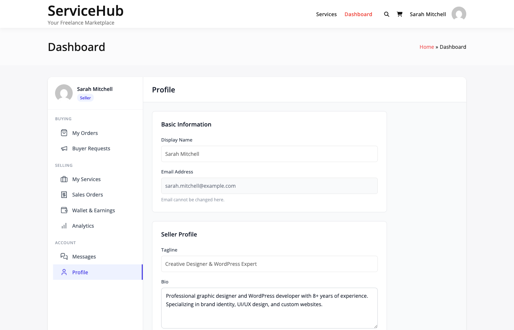

# Becoming a Vendor

Anyone on your marketplace can apply to become a vendor and start selling services. How the registration process works depends on which mode you have chosen as the site owner.

## Three Registration Modes

You control how vendors join your marketplace from **Settings > Vendors**:

### Open Registration

Anyone can sign up and start selling immediately. Their account is activated right away and they can create their first service within minutes. This is the best option for growing marketplaces where you want to attract as many sellers as possible.

### Requires Approval

Users can submit a vendor application, but their account stays in "Pending" status until you review and approve it. This gives you quality control over who sells on your marketplace. You will receive a notification when new applications come in.

**To review applications:** Go to **Sell Services > Vendors**, filter by "Pending" status, and approve or reject each application. The applicant receives an email letting them know the outcome.

### Closed Registration

The registration form is hidden from the public. Only you (the admin) can create vendor accounts manually. This is ideal for invite-only or exclusive marketplaces.

**To add a vendor manually:** Go to **Users > Add New**, create a WordPress account, and assign the vendor role.

## The Registration Form

When registration is open or requires approval, your "Become a Vendor" page
opens with what your marketplace offers -- how many sellers and services you
already have, and how much of each order a seller keeps -- followed by how
selling works, with the sign-up card beside it.

A visitor who is not signed in creates their account there and then. The form
asks only for what an account needs:

- **Your name** -- their public vendor name.
- **Email**
- **Password** -- at least 8 characters.

Profile details -- tagline, bio, skills, country, social links -- come
afterwards in the profile editor, so nobody is asked to write a bio before they
have decided to sign up.

If a user is already signed in with a buyer account, the card offers a single
**Register as Vendor** button instead: they upgrade in one click without
creating a second account.

The figures in the header come from your own site, and any that would not
flatter it are left out -- a new marketplace does not advertise "0 sellers".
Filter them with `wpss_vendor_pitch_stats`, and the "How it works" steps with
`wpss_vendor_pitch_steps`.

## What Happens After Registration

**Open mode:** The vendor can immediately access their dashboard, set up their profile, and create services.

**Approval mode:** The vendor sees a "Pending Approval" message and waits for your review. Typical review time is 1-3 business days. Once approved, they receive an email and can start selling right away.

**Closed mode:** The vendor is created by you, so they are active from the start.

## What Vendors Can Do

Once active, vendors have access to:

| Feature | Description |
|---------|-------------|
| Vendor Dashboard | Their central hub for managing everything |
| Create Services | List services with pricing, packages, and descriptions |
| Receive Orders | Accept and fulfill buyer orders |
| Portfolio | Showcase previous work to attract buyers |
| Buyer Requests | Browse and respond to service requests posted by buyers |
| Messages | Communicate with buyers about orders |
| Earnings | Track income and request withdrawals |

## Tips for Getting Approved

If your marketplace requires approval, here are tips for applicants:

- Use a professional email address.
- Fill in every field completely -- sparse applications get rejected more often.
- Clearly describe the services you plan to offer.
- List relevant skills and experience.
- Be responsive if the admin reaches out with questions.

## Next Steps After Registration

1. [Set up your vendor profile](vendor-profile-portfolio.md) -- Add your photo, bio, and portfolio.
2. [Explore the vendor dashboard](vendor-dashboard.md) -- Learn where everything is.
3. [Create your first service](../service-creation/service-wizard.md) -- Start selling.
4. [Learn about seller levels](seller-levels.md) -- Understand how to advance.

## Related Documentation

- [Vendor Dashboard](vendor-dashboard.md)
- [Vendor Settings (Admin)](vendor-settings.md)
- [Seller Levels](seller-levels.md)
