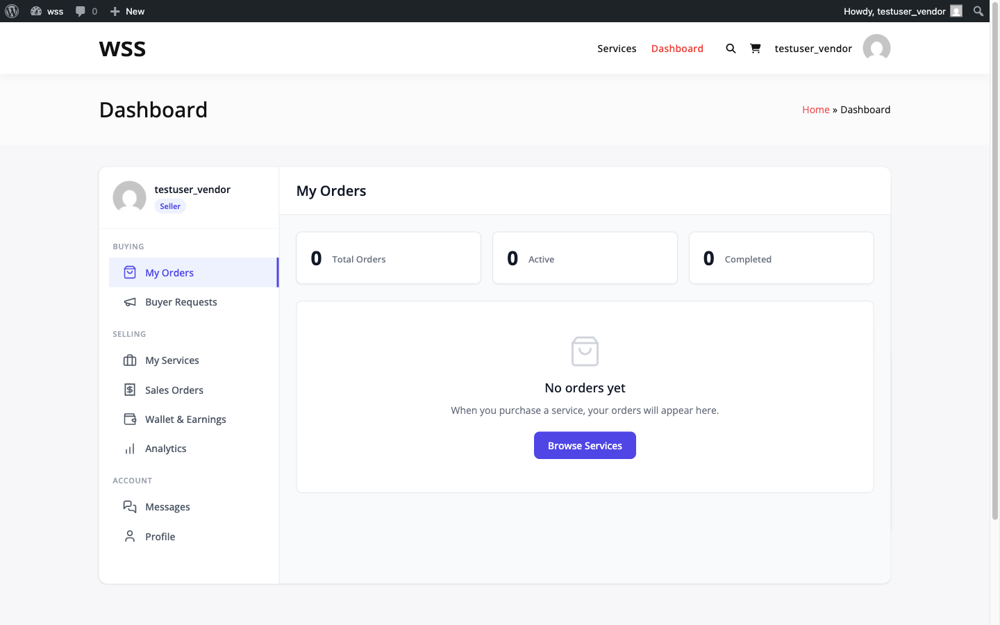
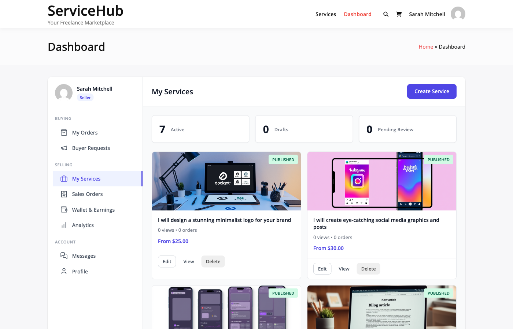

# Vendor Dashboard

The unified dashboard provides access to all vendor selling activities and buyer purchasing activities in one interface.

## Accessing the Dashboard

The dashboard uses the `[wpss_dashboard]` shortcode and automatically shows appropriate sections based on your role:

- **Buyers**: Order management and buyer requests
- **Vendors**: All buying features plus selling tools
- **Both**: Unified view of all activities

Navigate to the dashboard page (typically at `/dashboard/` or via My Account).

## Dashboard Sections

The unified dashboard organizes features into three groups:

### Buying Section

Available to all users:

- **Orders** (My Orders): Track purchases you've made
- **Requests** (Buyer Requests): Post and manage service requests

### Selling Section

Available to vendors only:

- **Services** (My Services): Manage your service listings
- **Sales** (Sales Orders): Orders received from buyers
- **Earnings**: Financial dashboard and withdrawals **[PRO]**

### Account Section

Available to all users:

- **Messages**: Order conversations with buyers/vendors
- **Profile**: Edit your vendor or buyer profile

## Dashboard Navigation

The sidebar shows your:

- Profile avatar and name
- "Seller" badge (if vendor)
- Grouped navigation sections
- "Start Selling" button (if not yet a vendor)

Click any section to switch views. The active section is highlighted.

## Orders Section (Buyer View)

View services you've purchased:

**Order List Shows:**
- Order number and status
- Service name and vendor
- Order total and date
- Quick actions (View, Message Vendor)

**Available Filters:**
- All orders
- Active orders
- Completed orders
- Cancelled orders

## Sales Section (Vendor View)

Manage orders received from buyers:

**Sales List Shows:**
- Order number and buyer name
- Service purchased
- Order total and your earnings
- Delivery deadline
- Order status and actions

**Order Statuses:**
- Pending Payment
- Pending Requirements
- In Progress
- Revision Requested
- Delivered
- Completed
- Cancelled
- Disputed

**Quick Actions:**
- View order details
- Upload delivery
- Message buyer
- Request extension

## Services Section (Vendor View)

Create and manage your service listings:

**Available Actions:**
- **Create Service**: Click button in header
- **Edit Service**: Update pricing and details
- **Pause/Activate**: Toggle service availability
- **Delete Service**: Remove listing (if no active orders)
- **View Analytics**: Service performance stats

**Service Information Displayed:**
- Service title and thumbnail
- Status (Published, Draft, Paused)
- Price range
- Total orders received
- Average rating
- Active orders count

## Messages Section

Communicate about orders:

**Features:**
- Order-based conversation threads
- File attachments
- Read/unread indicators
- Real-time updates (when available)

**Best Practices:**
- Respond within 24 hours
- Keep communication professional
- Document requirements clearly
- Use platform messaging only

## Earnings Section **[PRO]**

Track income and request withdrawals:

**Overview Shows:**
- Total Earnings (lifetime gross)
- Pending Earnings (clearing period)
- Available for Withdrawal
- Withdrawn Amount

**Commission Display:**
Each order shows:
- Order total (buyer paid)
- Platform commission deducted
- Your net earnings

**Withdrawal Process:**
1. Navigate to Earnings → Withdraw
2. Enter amount (minimum applies)
3. Select payment method
4. Submit request
5. Admin processes withdrawal

Learn more: [Earnings Dashboard](../earnings-wallet/earnings-dashboard-wpss.md)

## Profile Section

Edit your vendor profile:

**For Vendors:**
- Display name and tagline
- Professional bio
- Avatar and cover image
- Country, city, timezone
- Website URL
- Social links (JSON format)
- Skills and languages (future feature)

**For Buyers:**
- Basic profile information
- Avatar
- Contact preferences

Learn more: [Vendor Profile & Portfolio](vendor-profile-portfolio.md)

## Create Section

Quick access to:

- **Create Service**: Service creation wizard
- **Create Request** (if buyer): Post a service request

Only vendors see the Create Service option.

## Dashboard Statistics

The overview section displays:

| Metric | Description |
|--------|-------------|
| **Active Orders** | Orders in progress (buyer view) |
| **Active Sales** | Orders to fulfill (vendor view) |
| **Total Revenue** | Lifetime earnings (vendors) |
| **Average Rating** | Overall rating (vendors) |
| **This Month** | Current month activity |

## Responsive Design

The dashboard works on:

- Desktop computers (full sidebar navigation)
- Tablets (collapsible sidebar)
- Mobile phones (hamburger menu)

Access your dashboard anywhere to stay connected.

## Section URLs

Each section has a unique URL parameter:

- `/dashboard/` - Default (Orders)
- `/dashboard/?section=sales` - Sales Orders
- `/dashboard/?section=services` - My Services
- `/dashboard/?section=requests` - Buyer Requests
- `/dashboard/?section=messages` - Messages
- `/dashboard/?section=earnings` - Earnings **[PRO]**
- `/dashboard/?section=profile` - Profile
- `/dashboard/?section=create` - Create Service
- `/dashboard/?section=create-request` - Post Request

Bookmark specific sections for quick access.

## Start Selling Button

Non-vendors see a "Start Selling" button in the sidebar:

**Clicking It:**
1. Confirms intent via modal
2. Registers user as vendor
3. Redirects to Services section
4. Shows success message

Vendor sections appear immediately after registration.

## Dashboard Tips

1. **Check Daily**: Review new orders and messages
2. **Enable Notifications**: Get alerts for important events
3. **Use Filters**: Organize orders efficiently
4. **Mobile App**: Access dashboard on the go
5. **Quick Actions**: Use row actions for efficiency
6. **Keyboard Shortcuts**: Navigate faster (when available)

## Troubleshooting

### Dashboard Not Loading

- Clear browser cache and cookies
- Disable browser extensions
- Try incognito/private mode
- Check JavaScript console for errors

### Missing Sections

**Vendor sections not visible:**
- Verify vendor role assigned
- Check account status is "Active"
- Confirm vendor features enabled

**Earnings section missing:**
- Requires Pro plugin
- Check Pro plugin activation

### Orders Not Displaying

- Verify correct section (Orders vs Sales)
- Check status filters
- Ensure orders exist
- Refresh page
- Contact support if data missing

## Related Resources

- [Vendor Profile & Portfolio](vendor-profile-portfolio.md)
- [Seller Levels](seller-levels.md)
- [Order Management](../order-management/order-lifecycle-wpss.md)
- [Earnings & Withdrawals](../earnings-wallet/earnings-dashboard-wpss.md)
