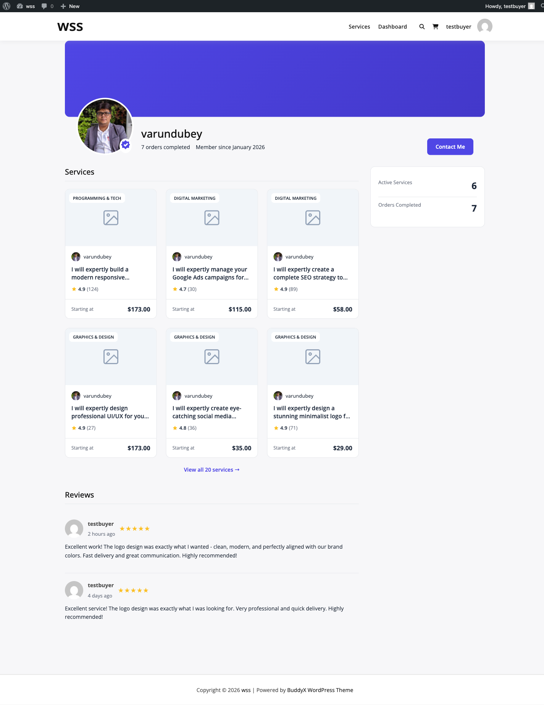
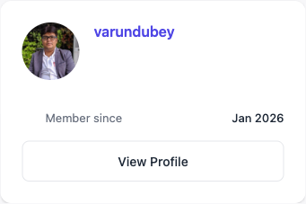

# Vendor Profile & Portfolio

Your vendor profile is your marketplace identity. A complete, professional profile attracts buyers and builds trust.

## Accessing Profile Settings

1. Log in to your vendor account
2. Navigate to **Dashboard → Profile**
3. Edit your vendor information


## Profile Fields

### Basic Information

Complete these essential fields stored in the `wpss_vendor_profiles` table:

| Field | Database Column | Description |
|-------|-----------------|-------------|
| **Display Name** | `display_name` | Your public vendor name |
| **Tagline** | `tagline` | One-line description |
| **Bio** | `bio` | About you section (text) |
| **Avatar** | `avatar_id` | Profile photo (attachment ID) |
| **Cover Image** | `cover_image_id` | Banner background (attachment ID) |
| **Country** | `country` | Your country |
| **City** | `city` | Your city |
| **Timezone** | `timezone` | Your timezone |
| **Website** | `website` | Portfolio or business website URL |
| **Social Links** | `social_links` | JSON-encoded social profiles |

### Social Links Format

Social links are stored as JSON:

```json
{
  "website": "https://example.com",
  "linkedin": "https://linkedin.com/in/username",
  "twitter": "https://twitter.com/username",
  "github": "https://github.com/username"
}
```

Add any social platform URLs relevant to your services.

### Location Information

The profile includes location fields:

- **Country**: Required for vendor directory filtering
- **City**: Optional, helps buyers find local vendors
- **Timezone**: Helps buyers understand your working hours

### Profile Statistics

These metrics display automatically (read-only):

| Stat | Database Column | Description |
|------|-----------------|-------------|
| **Total Orders** | `total_orders` | All orders received |
| **Completed Orders** | `completed_orders` | Successfully delivered |
| **Average Rating** | `avg_rating` | Overall star rating (0-5) |
| **Total Reviews** | `total_reviews` | Number of reviews received |
| **Response Time** | `response_time_hours` | Average message reply time |
| **On-Time Delivery** | `on_time_delivery_rate` | Percentage delivered on time |
| **Verification Tier** | `verification_tier` | basic/verified/pro |

Statistics update automatically as you complete orders.

## Portfolio Section

Showcase your work with portfolio items stored in `wpss_portfolio_items` table.

### Adding Portfolio Items

1. Navigate to **Dashboard → Portfolio**
2. Click **Add Portfolio Item**
3. Fill in the form

### Portfolio Item Fields

| Field | Database Column | Required | Notes |
|-------|-----------------|----------|-------|
| **Title** | `title` | Yes | Project name (varchar 255) |
| **Description** | `description` | No | Project details (text) |
| **Media** | `media` | No | JSON array of attachment IDs |
| **External URL** | `external_url` | No | Live project link (varchar 255) |
| **Tags** | `tags` | No | JSON array of keywords |
| **Service ID** | `service_id` | No | Link to related service |
| **Featured** | `is_featured` | No | Highlight best work |
| **Sort Order** | `sort_order` | No | Display order (int) |

**Note:** Category, Completion Date, and Client fields do NOT exist in the database schema.

### Portfolio Limits

- **Maximum Items**: 50 (configurable via `wpss_max_portfolio_items` option)
- **Maximum Featured**: 6 (configurable via `wpss_max_featured_portfolio` option)

Attempting to exceed these limits will display an error message.

### Media Format

Portfolio media is stored as JSON array of attachment IDs:

```json
[123, 456, 789]
```

The system automatically generates URLs and thumbnails when displaying items.

### Featured Items

Mark your best work as featured:

- Maximum 6 featured items (default)
- Featured items display first in portfolio
- Prominently shown on vendor profile
- Used in vendor cards and previews

Toggle featured status via the portfolio management interface.

### Organizing Portfolio

- **Drag and Drop**: Reorder items by changing `sort_order`
- **Edit Items**: Update details anytime
- **Delete Items**: Remove old work
- **Filter by Service**: Link items to specific services

## Verification Status

Your verification tier shows on your profile:

- **Basic**: Default starting tier (all new vendors)
- **Verified**: Email or identity verified
- **Pro**: Premium verification status

Verification tier is stored in `verification_tier` column and affects:
- Badge display on profile and services
- Search ranking
- Buyer trust signals

Learn more: [Seller Levels](seller-levels.md)

## Vacation Mode

Control your availability with vacation mode fields:

| Field | Database Column | Type | Description |
|-------|-----------------|------|-------------|
| **Vacation Mode** | `vacation_mode` | Boolean | On/off toggle |
| **Vacation Message** | `vacation_message` | Text | Message shown to buyers |

**Important:** There are NO start date, end date, or auto-return fields. Vacation mode is a simple on/off toggle with an optional message.

When vacation mode is enabled:
- Services cannot be ordered
- Profile shows vacation message
- You must manually turn it off to resume

Learn more: [Vacation Mode](vacation-mode.md)

## Profile Visibility

Your profile displays in several locations:

### Vendor Listing Pages

Your profile card shows:
- Avatar and display name
- Tagline
- Average rating and review count
- Verification badge
- Featured portfolio items

### Service Pages

Your profile summary appears on each service:
- Avatar and name
- Rating
- Response time
- Link to full profile

### Vendor Profile Page



Complete profile view includes:
- Cover image and avatar
- Display name and tagline
- Full bio
- Location (country, city, timezone)
- Website and social links
- Statistics (orders, rating, response time)
- All services
- Portfolio gallery
- Reviews


### Service Page Sidebar

Your vendor information is also displayed in the sidebar on individual service pages, giving buyers quick access to your profile details and ratings.



## Tips for a Strong Profile

1. **Professional Photos**: Use high-quality avatar (400x400px minimum)
2. **Compelling Bio**: Highlight expertise and experience
3. **Complete Location**: Helps buyers find local vendors
4. **Active Portfolio**: Showcase 5-10 best projects
5. **Accurate Timezone**: Manage buyer expectations
6. **Professional Links**: Link active social profiles
7. **Regular Updates**: Keep portfolio current

## Troubleshooting

### Profile Changes Not Saving

**Check:**
- Required fields completed
- Images meet size requirements (check server limits)
- Valid timezone format
- JSON format for social links
- No PHP errors in debug log

### Portfolio Images Not Uploading

**Verify:**
- File size within WordPress limits
- Supported formats (JPG, PNG, GIF)
- Server upload permissions
- `upload_files` capability granted to vendor role

### Cannot Add More Portfolio Items

**Reason:**
- Maximum limit reached (50 items default)
- Check admin settings: `wpss_max_portfolio_items` option

**Solution:**
- Delete old items
- Contact admin to increase limit

### Featured Items Limit Reached

**Reason:**
- Maximum 6 featured items (default)
- Check `wpss_max_featured_portfolio` option

**Solution:**
- Unfeature existing items before adding new ones
- Contact admin to adjust limit

## Related Resources

- [Seller Levels](seller-levels.md) - Verification tiers explained
- [Vacation Mode](vacation-mode.md) - Manage availability
- [Vendor Dashboard](vendor-dashboard.md) - Access your profile settings
